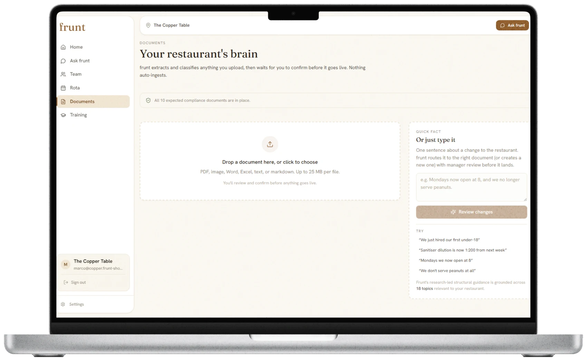
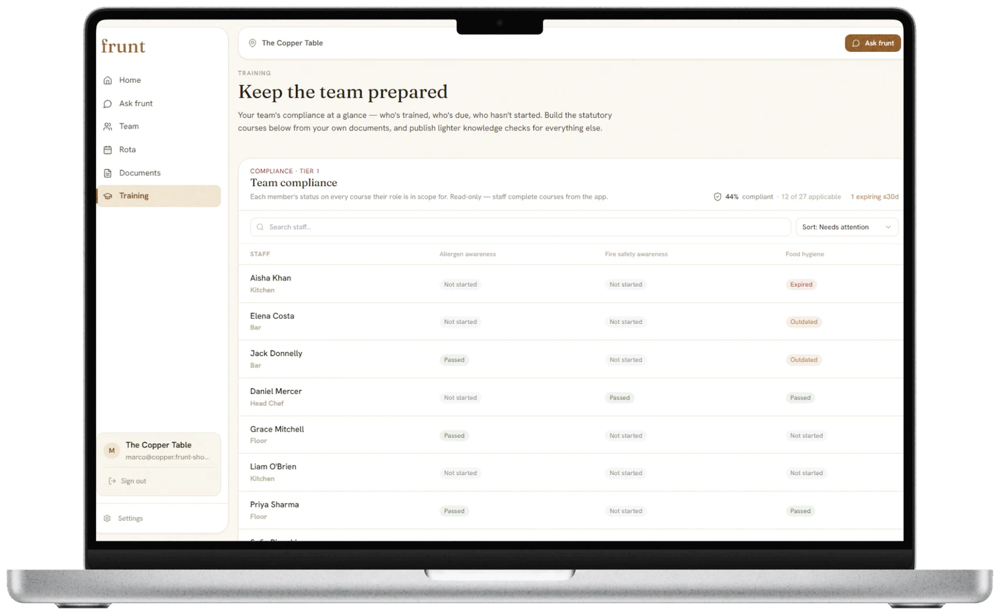
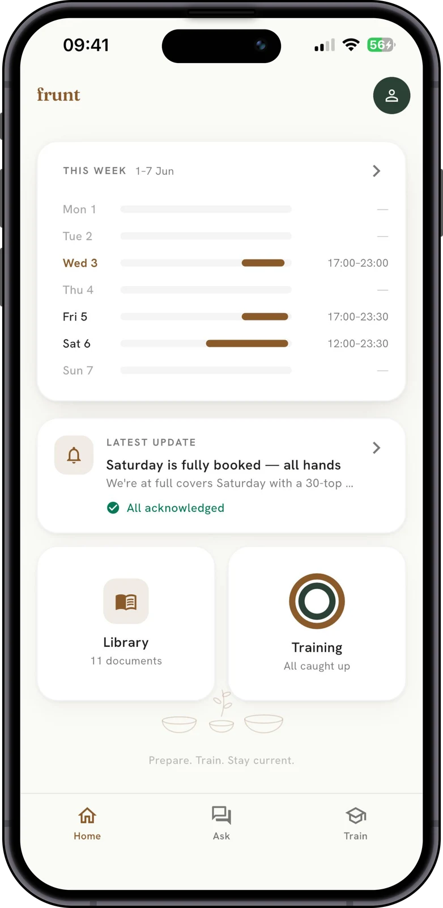

# frunt

A preparation platform for restaurant teams. frunt turns a restaurant's existing documents (allergen guides, SOPs, compliance paperwork) into staff training, onboarding, and compliance, with a manager dashboard and a native staff app.

**Live:** [frunthospitality.com](https://frunthospitality.com)

## What it does

- Turns a venue's existing documents into structured staff training and onboarding
- Tracks training completion and compliance across the team
- Manager dashboard on the web, plus a native app for staff
- Answers questions hidden in a venue's own documents, with the source

## Built with

Next.js · TypeScript · Flutter / Dart · Supabase · PostgreSQL

## Screenshots

Manager dashboard (web):

Staff app:

---

A product of [MGKCodes](https://mgkcodes.com).
